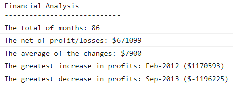

# Console Finances 🏦
Console application to show the financial records of a company.

## Why I created this console app? 🤔
I wanted to test my knownldge on JavaScript arrays, printing in the console, for-loops and ```.sort()```. I created JavaScript code for analyzing the records.

## Screenshot 📸
This is the output of the console application: <br><br>

